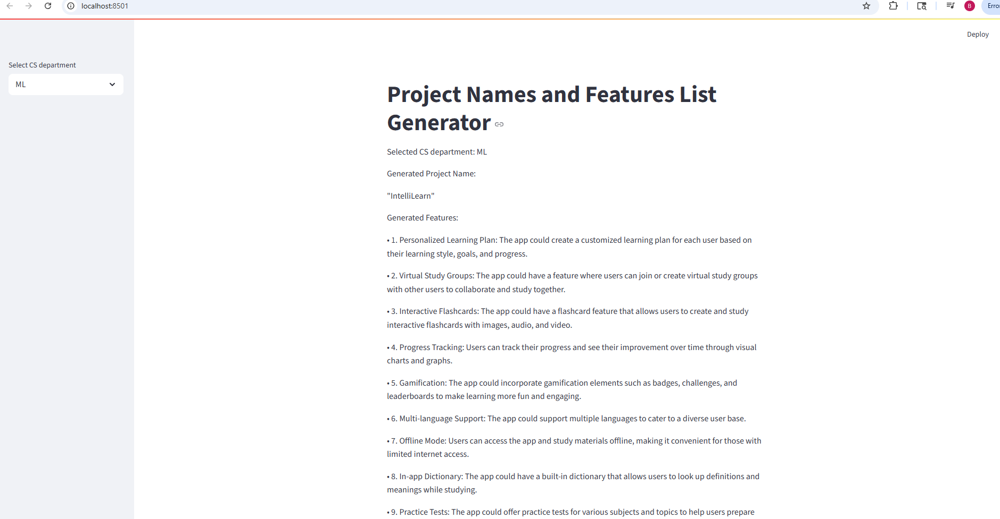

# Langchain_project_and_feature_name_generator
Landchain project that generates project names and features list based on the topic given by user and hosted on streamlit
# 🔮 Project Name and Features Generator (LangChain + Streamlit)

This web application uses OpenAI's language model (via LangChain) to generate creative **project names** and a list of relevant **features** based on a selected **Computer Science domain**. It provides a fast and user-friendly way to brainstorm project ideas.

---

## 🖼️ Demo Preview

 <!-- Add a screenshot if desired -->

---

## 🚀 Features

- Select a CS domain (ML, AI, NLP, etc.) from a sidebar dropdown.
- Automatically generates:
  - A creative project name
  - A list of practical or innovative features
- Built using:
  - `LangChain` for prompt chaining
  - `Streamlit` for the web UI
  - `OpenAI GPT` for idea generation

---

## 🧠 Technologies Used

- [Streamlit](https://streamlit.io/)
- [LangChain](https://www.langchain.com/)
- [OpenAI GPT](https://platform.openai.com/)
- Python 3.10+

---

## 📁 File Structure
Langchain_project_and_feature_name_generator/
│
├── app.py # Main Streamlit app
├── langchain_helper.py # Handles LangChain logic
├── secret_file.py # Contains OpenAI API key
├── requirements.txt # Python dependencies
├── .gitignore # Ignores sensitive files like .pyc


---

## ⚙️ Setup Instructions

### 1. Clone the repository

```bash
git clone https://github.com/Bhavya02Arora/Langchain_project_and_feature_name_generator.git
cd Langchain_project_and_feature_name_generator
```

### 2. Create a virtual environment (recommended)
```bash
python -m venv venv
source venv/bin/activate  # or venv\Scripts\activate on Windows
```

### 3. Install dependencies

```bash
pip install -r requirements.txt
```

###  4. Add your OpenAI API key
Create a secret_file.py:
```python
# secret_file.py
openapi_key = "sk-..."  # Replace with your real API key
```

### 5. Run the Streamlit app

```bash
streamlit run app.py
```

### 6. Open your browser
Navigate to `http://localhost:8501` to see the app in action.
---
## 📖 Usage Instructions
1. **Select a Computer Science domain** from the dropdown menu.
2. Click the "Generate" button.
3. The app will display:
   - A creative project name
   - A list of features relevant to that domain
   - A brief description of the project idea

